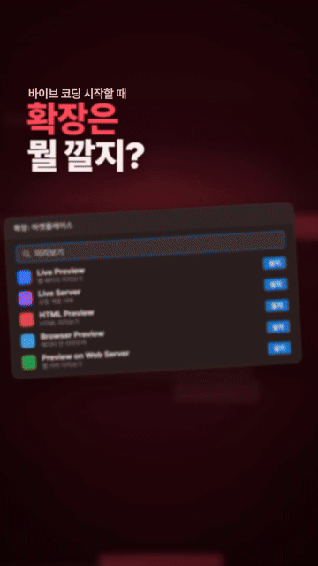

<p align="center">
  <a href="https://arthong1.github.io/Opus-promo-Director/"></a>
</p>

<p align="center">
  <a href="https://arthong1.github.io/Opus-promo-Director/"><strong>▶ 소리 켜고 전체 쇼츠 영상 보기 (34초)</strong></a>
</p>

# Opus Promo Director

AI 코딩 에이전트가 모션 스튜디오처럼 일하게 만드는 영상 감독 스킬이에요. 서비스, 앱, 책, 제품, 행사의 10~60초 홍보 영상을 사용자와 함께 룩부터 고르고, 음악 박자에 맞춘 모션그래픽으로 끝까지 만들어요. 만든 뒤에는 스스로 비평하고 9:16·16:9·4:5로 납품해요.

위 영상은 바이브 코딩 팁과 도서 『바로 배워서 바로 써먹는 AI 에이전트』를 함께 소개하는 9:16 세로형 홍보 쇼츠 영상이에요. 시선을 끄는 빠른 템포의 편집과 타이포그래피, 음악 비트에 맞춘 모션그래픽으로 제작되었어요.

> English summary: an agent skill that directs short promo videos. It pins down the look with the user through style frames, builds beat-synced Remotion motion graphics with AI-generated assets, reviews its own renders against the chosen reference, and delivers checked 9:16, 16:9 and 4:5 files. Instructions are in Korean.

## 무엇이 다른가요

도구 사용법은 Remotion 공식 스킬 같은 공식 자료에 맡기고, 이 스킬은 감독의 판단을 다뤄요. 실제 영상을 만들며 사용자에게 거절당하고 다시 만든 기록에서 규칙을 뽑았어요.

- **룩을 먼저 고정해요.** 참고 영상, 밝기, 화면 밀도, 캐릭터 여부를 묻고, 룩이 서로 다른 스타일프레임을 보여 드려 고르게 한 뒤에만 제작해요. 원고의 색 안내나 스킬 기본값이 사용자의 말을 이기지 않아요.
- **박자에 맞춰 편집해요.** 곡의 BPM과 구간을 재고, 모든 컷과 효과음을 박자 단위 프레임에 둬요.
- **움직임은 움직임으로 봐요.** 정지 화면 대신 컷 앞뒤 프레임, 사용자가 고른 기준 영상과의 나란히 비교, 세로 안전 영역 검사로 비평해요.
- **납품을 검수해요.** 해상도, 길이, 색 형식, 음량, 효과음 타이밍을 스크립트로 확인하고, 확인하지 못한 것은 보고서에 따로 적어요.

## 잘하는 스타일과 약한 스타일

| 룩 | 상태 |
|---|---|
| 어두운 무대 위 광택 3D 오브젝트 + 네온 | 강함 |
| 밝은 팝 포스터 톤 + 굵은 외곽선 글자 + 실제 포스터 재료 (위 데모) | 강함 |
| 입체 3D 글자·로고 | 쓸 만함 |
| 밝은 종이·공예 질감, 화면을 여러 칸으로 나눈 정보 배치 | 약함 |
| 캐릭터가 팔다리를 움직이는 애니메이션 | 약함 (포즈 이미지를 바꿔 끼우는 수준) |
| 실사 촬영, 손그림 셀 애니메이션 | 못 함 |

약한 스타일을 원하시면 스킬이 제작 전에 한계를 말하고 가장 가까운 룩을 함께 보여 드려요.

## 설치

스킬 폴더 하나를 에이전트의 스킬 디렉터리에 복사하면 돼요.

```bash
git clone https://github.com/ARTHONG1/Opus-promo-Director.git

# Codex
cp -r Opus-promo-Director/skills/opus-promo-director ~/.codex/skills/
# Claude Code
cp -r Opus-promo-Director/skills/opus-promo-director ~/.claude/skills/
```

Windows PowerShell에서는 `Copy-Item -Recurse Opus-promo-Director\skills\opus-promo-director $HOME\.codex\skills\`처럼 복사해요.

Remotion 코드를 쓰기 전에 [Remotion 공식 스킬](https://github.com/remotion-dev/skills)을 함께 설치하는 것을 권해요. 이 스킬은 품질 판단을, 공식 스킬은 API 사용법을 맡아요.

## 필요한 것

| 도구 | 쓰임 | 없으면 |
|---|---|---|
| Node.js 18 이상 | Remotion 렌더 | 필수 |
| Python 3.9 이상, numpy, Pillow | 검수·믹스 스크립트 | 필수 |
| ffmpeg | 인코딩, 프레임 추출 | 시스템에 없으면 Remotion이 설치한 복사본을 자동으로 찾아요 |
| 이미지 생성 도구 | 오브젝트, 스타일프레임 | 사용자 재료와 코드로 만든 그래픽만으로도 가능해요 |
| Blender | 오프닝 한 컷 등 선택 | 없으면 건너뛰어요 |

`python skills/opus-promo-director/scripts/preflight.py`로 한 번에 확인할 수 있어요.

## 사용 예

```
$opus-promo-director 우리 연구회 11월 행사 홍보 영상을 30초로 만들어줘. 포스터는 첨부했어. 릴스랑 유튜브용 둘 다.
```

에이전트는 룩 질문 → 재료 정리 → 스타일프레임 선택 → 박자 애니매틱 → 제작 → 감독 리뷰 → 납품 순서로 진행해요. 결정과 진행 상황은 작업 폴더의 `production/`에 남아서, 대화가 끊겨도 이어서 만들 수 있어요.

## 걸리는 시간

GPU 없는 Windows PC 기준으로 20~30초 영상 한 편은 기획부터 납품까지 보통 1~3시간, 60초 영상은 3~5시간 걸렸어요. 60초 1080p 영상 하나를 렌더하는 데만 약 6분이 걸리고, 세로와 가로 두 비율이면 두 배예요.

## 들어 있는 것

```
skills/opus-promo-director/
  SKILL.md                 감독 원칙, 제작 흐름, 품질 기준, 피드백 대응
  references/              룩 찾기, 컨셉, 비평 절차, 플랫폼 규격, 소리, 현장 교훈, 프롬프트
  scripts/                 preflight, song_map, beat_grid, mix, master_wav,
                           review_sheet, safe_zone, cue_check, audio_check, deliver
  assets/remotion-kit/     바로 쓰는 Remotion 부품 (HeroObject, Stage, Slam, SafeArea 등)
```

## 한계

- 소리를 켜고 처음부터 끝까지 듣는 일은 스킬이 대신할 수 없어요. 스크립트는 음량과 효과음 타이밍만 재요.
- 세로 안전 영역은 2026년 9월 기준의 보수적인 값이에요. 앱 화면 배치가 바뀔 수 있으니 올리기 전에 앱에서 미리 보세요.
- AI로 만든 이미지는 이미지 생성 서비스의 약관을 따라요. 상업적으로 쓰는 영상이면 [Remotion 라이선스](https://www.remotion.dev/license)도 확인하세요.

## 라이선스

스킬과 코드는 [MIT](LICENSE)예요. `docs/media/`의 데모 영상과 이미지 저작물은 MIT 라이선스에 포함되지 않으며, 허락 없이 무단으로 사용하거나 배포할 수 없어요.
